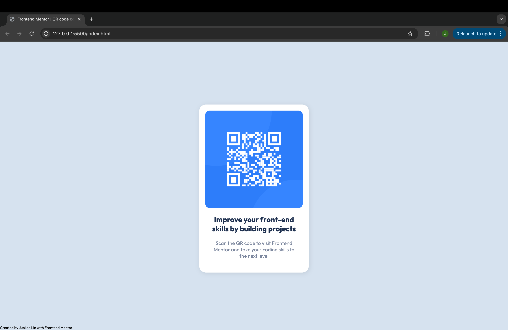

# Frontend Mentor - QR code component solution

This is a solution to the [QR code component challenge on Frontend Mentor](https://www.frontendmentor.io/challenges/qr-code-component-iux_sIO_H). Frontend Mentor challenges help you improve your coding skills by building realistic projects. 

## Table of contents

  - [Screenshot](#screenshot)
  - [Links](#links)
  - [Built with](#built-with)
  - [What I learned](#what-i-learned)
  - [Continued development](#continued-development)
  - [Useful resources](#useful-resources)
- [Author](#author)

### Screenshot

### Links

- Challenge URL: [Add solution URL here](https://www.frontendmentor.io/challenges/qr-code-component-iux_sIO_H)

### Built with

- Semantic HTML5 markup
- CSS custom properties
- Flexbox

### What I learned

I initially struggled with centering the qr card om the page, and the only way I could figure out how to make the website look the same was to use margins to estimate the center of the page. However, this was not effective since it would not respond to changing the size of the page. Then, after researching CSS styles further, I figured out how to use vh measurements to allow my container to span the entirety of the website and center the card. 
Then, I was able to mimic the styles of the qr card easily with the use of flexbox and other CSS styles. 

### Continued development

I am still learning some HTML and CSS semantics as well as how to efficiently design responsive webpages. 

### Useful resources

- [Video Resource](https://youtu.be/G3e-cpL7ofc?si=k_37wGK1nX8Mj4BM) - This is how I learned the basics of HTML and CSS. I hope I can continue to expand on this knowledge as I work through more challenges and eventually develop my own designs.

## Author
- Frontend Mentor - [@jubileelin](https://www.frontendmentor.io/profile/jubileelin)
